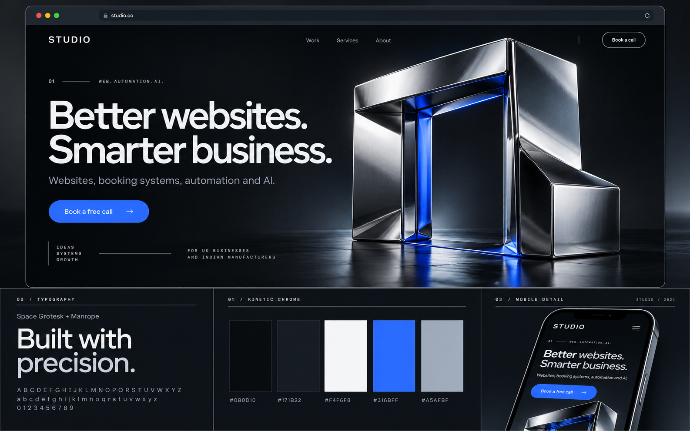
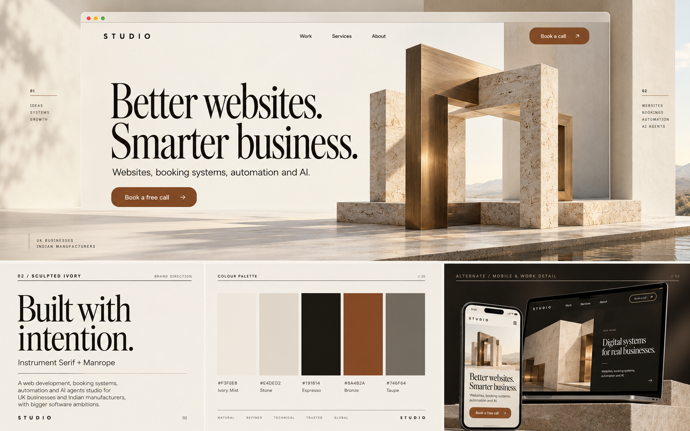
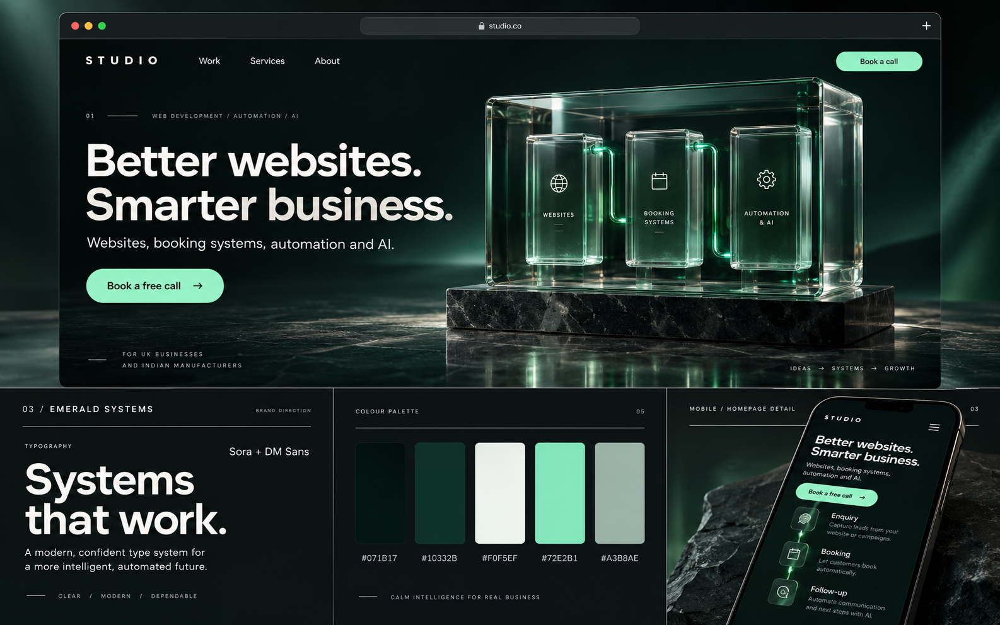
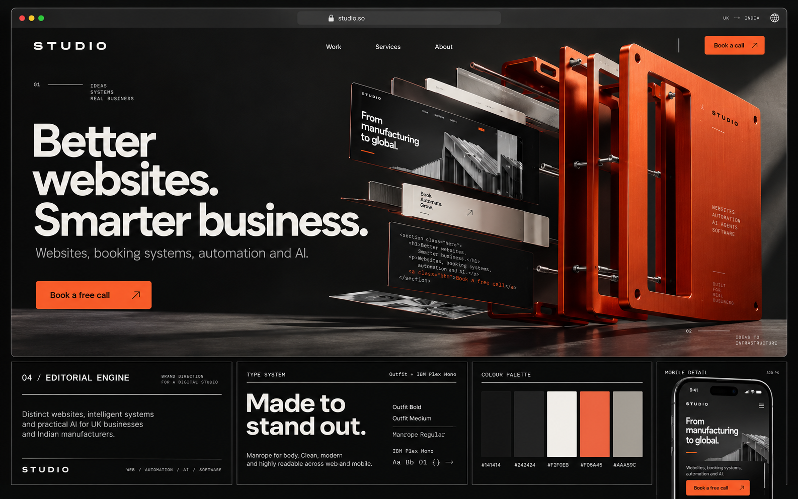

# Website Brand Directions

Four visual directions for a web development, booking systems, automation and AI studio.

## View the comparison

**[Open the interactive preview](https://oliviaharsh.github.io/website-brand-directions/)**

Switch between the four themes to compare their concept boards, font specimens, exact palettes and proposed 3D motion. Click a color swatch to copy its hex code. Font specimens load from Google Fonts when online.

STUDIO is a temporary wordmark. The boards are static art-direction references for a future 3D website.

| Direction | Fonts | Visual character |
|---|---|---|
| Kinetic Chrome | Space Grotesk + Manrope | Carbon, cobalt and sculptural chrome |
| Sculpted Ivory | Instrument Serif + Manrope | Ivory, bronze and architectural stone |
| Emerald Systems | Sora + DM Sans | Deep forest, mint and optical glass |
| Editorial Engine | Outfit + Manrope, IBM Plex Mono accents | Graphite, vermilion and machined layers |

## Concept boards

### 01 — Kinetic Chrome

### 02 — Sculpted Ivory

### 03 — Emerald Systems

### 04 — Editorial Engine

## Details

- [Complete palettes, font specifications and 3D direction guide](brand-directions.md)
- [Image-generation prompts](generation-prompts.json)

## Open locally

Download the repository as a ZIP, extract it, and open `index.html` in a browser. Keep the PNG files beside it. No build step or package installation is required.
