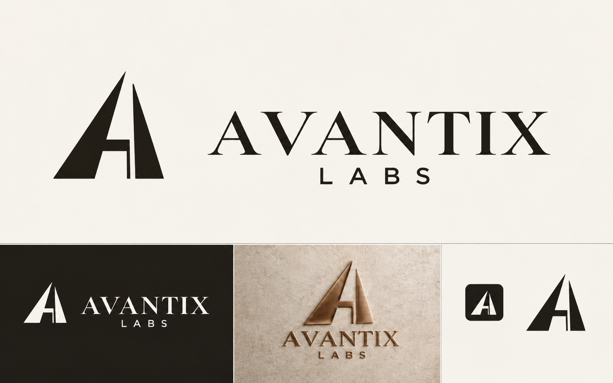
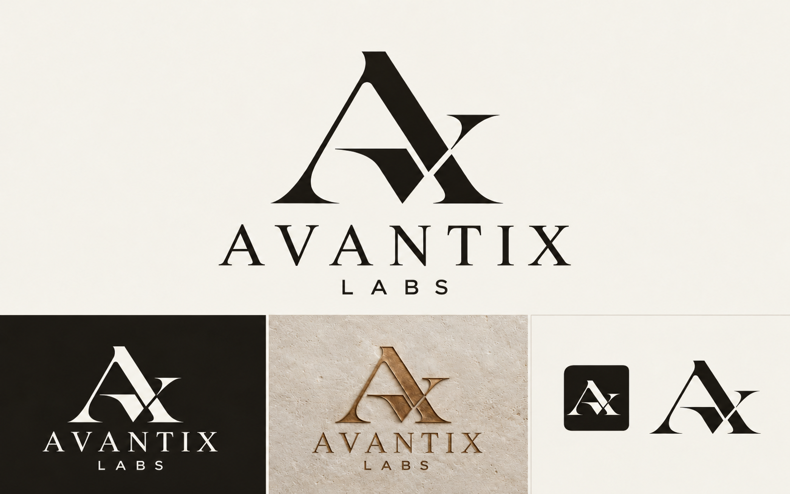
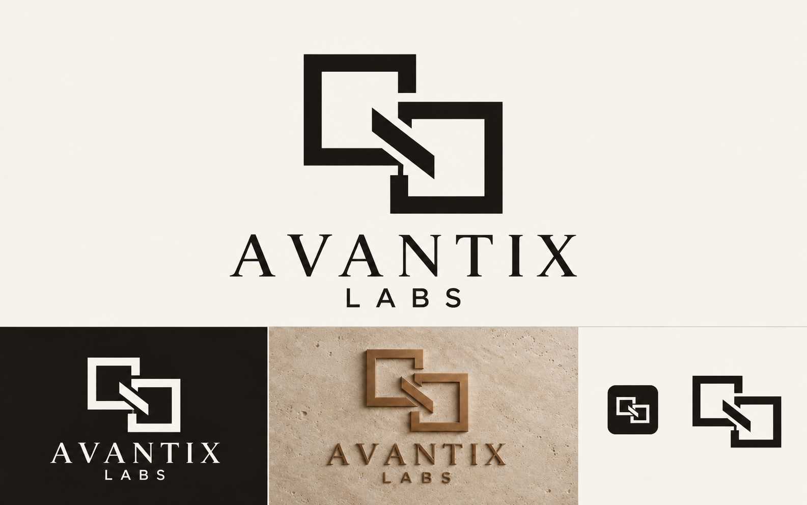
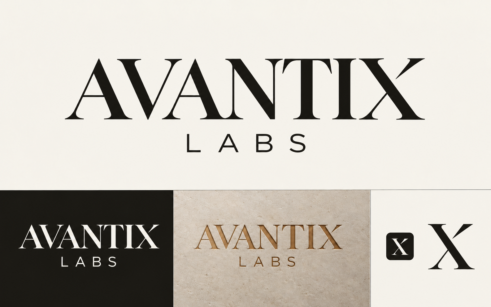
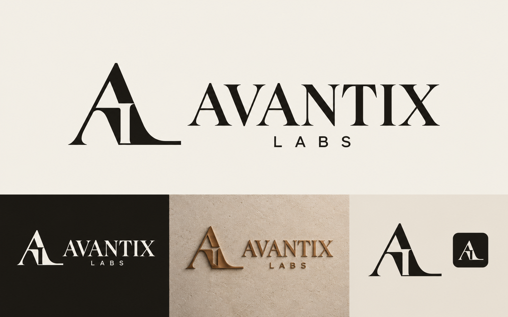
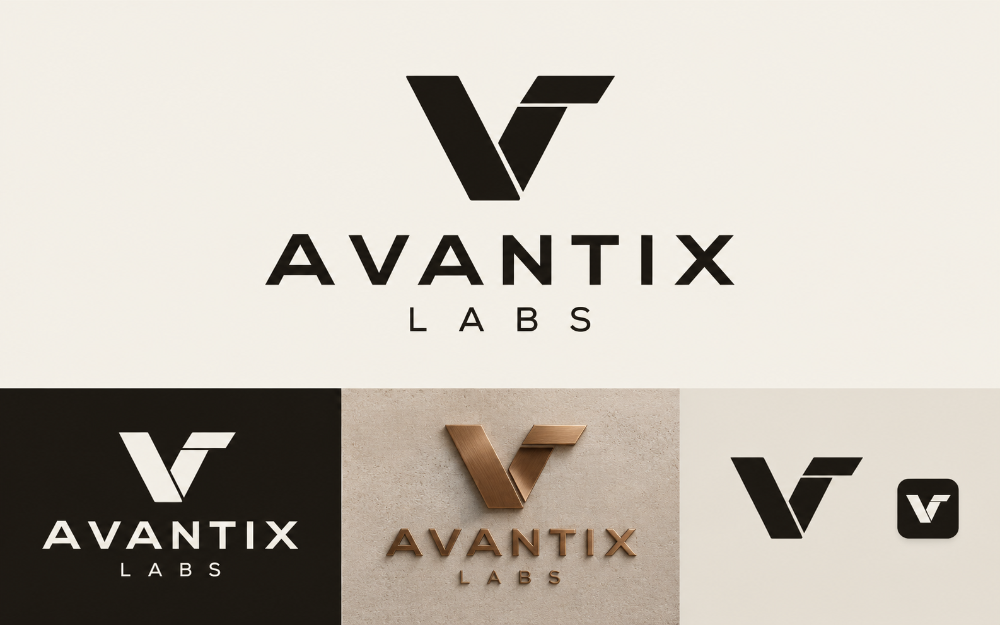
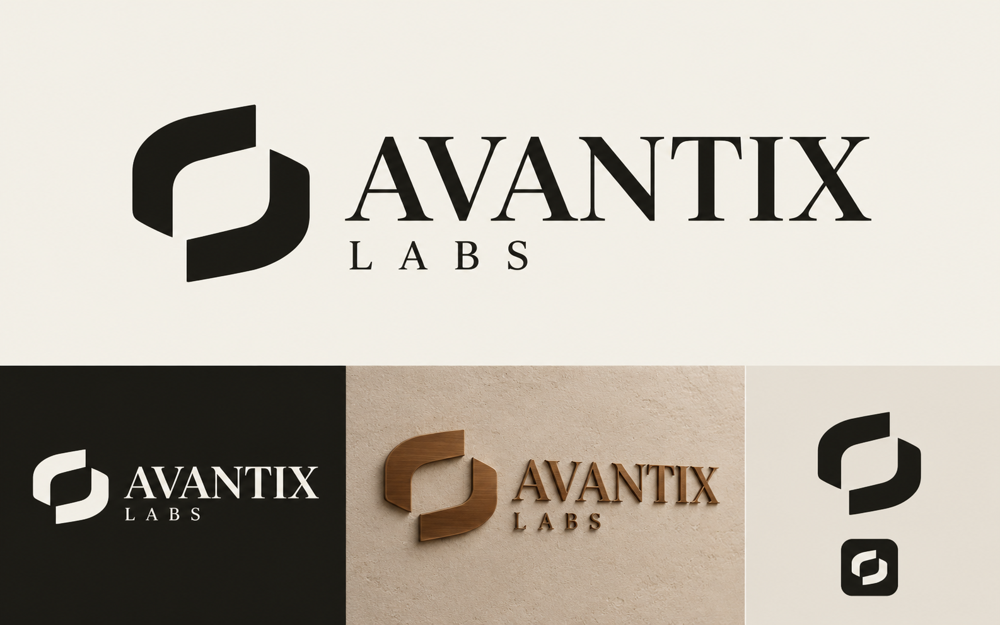
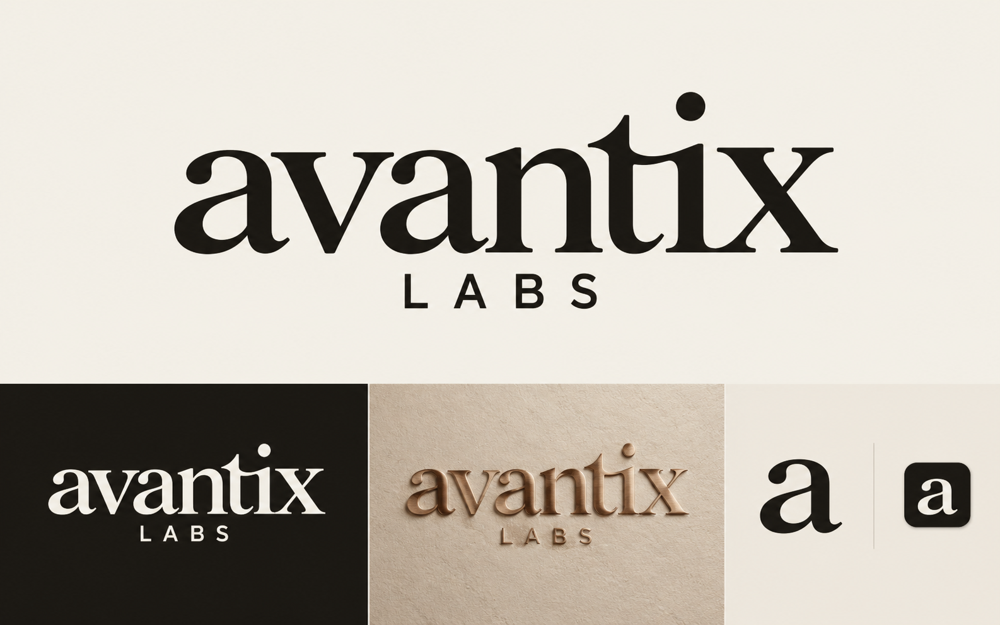

# AVANTIX LABS — Sculpted Ivory logo concepts

Correct business name: **AVANTIX LABS**. The main wordmark uses AVANTIX, with LABS as a smaller secondary line.

Eight logo concepts, retaining the warm ivory, espresso and bronze palette. Options 01–04 update the original concepts with the correct business name; options 05–08 explore additional directions.

| Option | Direction |
|---|---|
| 01 | Architectural A — a structural entrance mark |
| 02 | AX Monogram — first and last letters combined |
| 03 | Linked Frames — connected digital systems |
| 04 | Editorial Wordmark — typography with a distinctive X |
| 05 | AL Signature — Avantix and Labs initials in one editorial monogram |
| 06 | Folded V — geometric folded structure with a modern sans wordmark |
| 07 | Open Aperture — two architectural segments defining an opening |
| 08 | Humanist Wordmark — approachable lowercase lettering |

## 01 — Architectural A

## 02 — AX Monogram

## 03 — Linked Frames

## 04 — Editorial Wordmark

## 05 — AL Signature

## 06 — Folded V

## 07 — Open Aperture

## 08 — Humanist Wordmark

Each image shows the flat concept, a reversed application, a bronze material application and an icon preview. These raster presentations were created or edited using the built-in image generation tool. The original edit prompts are saved in `generation-prompts.json`; the additional concept prompts are in `generation-prompts-additional.json`. Final vector artwork and transparent production exports can follow selection.
