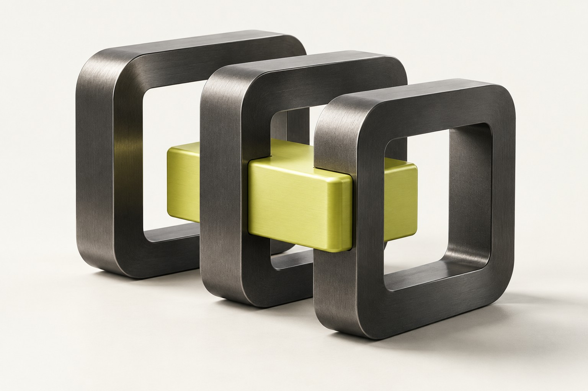
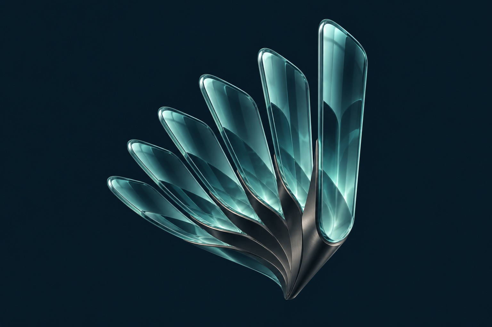
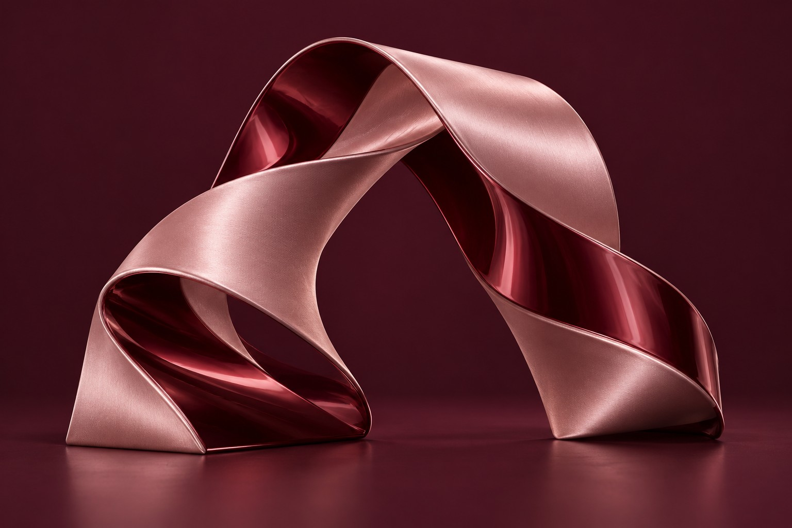
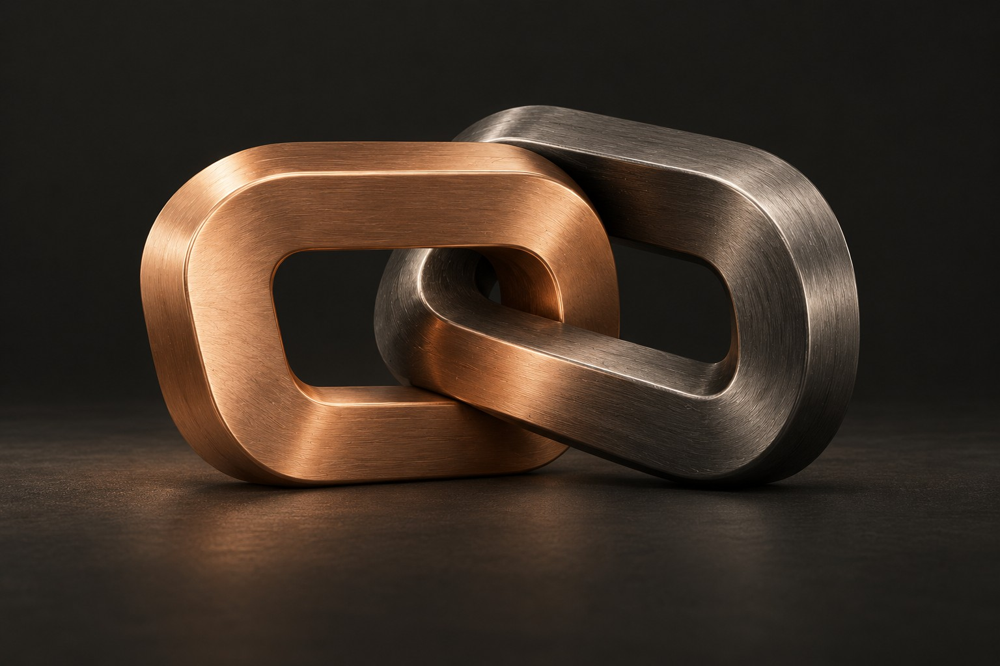

# Four new website directions for Avantix Labs

[Open the website preview](https://oliviaharsh.github.io/website-brand-directions/themes/).

These four additional directions explore the whole website: typography, colors, hero composition, service layout and interactive 3D. They are independent of the earlier logo additions.

## Note for Parth from Codex

Parth, please compare all four on a laptop and phone. Pick your favorite two by name, tell Harsh which layout has the strongest first impression, and mention anything you would change about the fonts, colors or sculpture. Use “Copy this theme link” to share the exact direction. We can combine elements after choosing a favorite.

Prepared for Harsh and Parth, 6 October 2026.

## Signal Bureau

[Open Signal Bureau](https://oliviaharsh.github.io/website-brand-directions/themes/#signal).

Warm paper and citron create a crisp, industrial identity. Barlow Condensed brings a compact poster-like headline; Public Sans keeps supporting copy clear. The split hero features graphite rails and a moving citron carrier. Services appear as two columns of expandable descriptions.

Palette: Paper `#F4F4EC`, Graphite `#22251F`, Citron `#D1DE59`, Stone `#E7E8DD`, Olive gray `#5A5F50`.

## Nocturne

[Open Nocturne](https://oliviaharsh.github.io/website-brand-directions/themes/#nocturne).

Midnight navy and aquamarine give the studio a composed, cinematic presence. Unbounded pairs with Onest. Architectural glass fins lead on the left while the headline sits on the right. A broad service list gives the page a calm rhythm.

Palette: Midnight `#081B26`, Pearl `#EBF3F2`, Aquamarine `#91DDD2`, Deep blue `#102A37`, Mist `#ADC1C9`.

## Garnet House

[Open Garnet House](https://oliviaharsh.github.io/website-brand-directions/themes/#garnet).

Burgundy, porcelain and rose create a couture-inspired creative identity. Cormorant Garamond adds editorial character; Karla keeps the service copy practical. A folded satin-like ribbon accompanies the serif headline. Staggered services echo the sculptural rhythm.

Palette: Garnet `#3A1727`, Porcelain `#F5EDE8`, Rose `#D5A6B4`, Wine `#492335`, Dusty blush `#D8BFC7`.

## Ember Studio

[Open Ember Studio](https://oliviaharsh.github.io/website-brand-directions/themes/#ember).

Charcoal and copper provide warmth within a dark industrial identity. Urbanist pairs with Work Sans. The centered headline leads into a wide assembly of interlocking metal links. Services use asymmetric tiles instead of the other themes' open lists.

Palette: Soot `#1B1B18`, Chalk `#F2ECE4`, Copper `#E9AF88`, Smoke `#2C2B27`, Warm gray `#BBB6AC`.

## What the preview includes

- Four distinct hero compositions and service layouts.
- Live Three.js sculptures with pointer response and a pause control.
- Reduced-motion support, offscreen rendering suspension and a still-image fallback when WebGL is unavailable.
- Self-hosted Latin web fonts, original font licenses and pinned Three.js 0.170.0 with its MIT license.
- Exact color swatches, font specimens, comparison images and direct theme links.

The images are generated art-direction references; the live scenes are simplified interactive geometry. Headlines are draft options, and this review page is not the final client-facing agency website. No theme or tagline has been selected yet.

To run locally, serve the repository over HTTP, then open `/themes/`. The preview uses ES modules and an import map, so opening the HTML directly via `file://` is not supported. `download-assets.py` documents the font and vendor download process. `generation-prompts.json` records the prompts used for the reference visuals.
